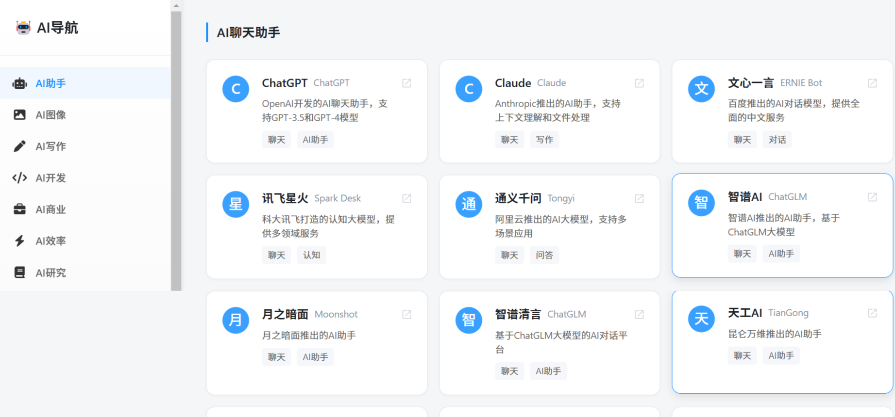

# AI导航

一个优雅的 AI 工具导航网站，帮助用户发现和使用最新最好的 AI 工具。专注于收录高质量的 AI 工具和资源，包括 AI 聊天、AI 图像生成、AI 写作、AI 开发等多个领域。

## ✨ 特点

- 🎯 精选全球数千个优质 AI 工具
- 🎨 现代简约的用户界面设计
- 📱 完美支持移动端浏览
- 🔍 实时搜索功能
- 🏷️ 多维度分类导航
- 🌈 美观的渐变色图标
- ⚡️ 快速加载和响应
- 🔄 持续更新收录优质工具
- 📊 工具评分和使用推荐
- 🌐 支持中英文双语显示

## 🔧 技术栈

- HTML5
- CSS3 (Flexbox & Grid)
- JavaScript (原生)
- Font Awesome 图标
- 响应式设计
- LocalStorage 数据持久化

## 📦 分类导航

- 🤖 AI助手 - ChatGPT、Claude、文心一言等智能对话工具
- 🎨 AI图像 - Midjourney、Stable Diffusion、DALL·E 等图像生成工具
- ✍️ AI写作 - Copy.ai、Jasper、写作猫等写作辅助工具
- 💻 AI开发 - GitHub Copilot、Cursor、Replit 等编程工具
- 💼 AI商业 - 营销、销售、客服等商业应用工具
- ⚡ AI效率 - 日程管理、笔记、知识库等效率工具
- 📚 AI研究 - 论文、学术、研究等学术工具
- 👥 AI社区 - 优质的 AI 交流和学习社区
- ⭐ AI生活 - 图像处理、音视频、生活服务等工具
- 👔 AI求职 - 简历优化、面试准备、职业规划工具
- 🎓 AI学习 - 在线课程、教育资源、学习平台
- 💡 提示词 - Prompt 编写、优化和分享平台

## 🚀 在线访问

访问 [https://yourusername.github.io/ai-navigation](https://yourusername.github.io/ai-navigation) 即可使用。

## 🔄 更新计划

- [ ] 添加工具评分和评论功能
- [ ] 支持用户收藏夹功能
- [ ] 增加工具使用教程
- [ ] 优化移动端体验
- [ ] 添加深色模式
- [ ] 支持多语言切换

## 🤝 贡献

欢迎提交 Issue 和 Pull Request 来帮助改进项目。

您可以通过以下方式贡献：
- 提交新的优质 AI 工具
- 报告问题或错误
- 改进用户界面和体验
- 补充工具使用说明
- 修复文档错误

## 📝 开源协议

[MIT License](LICENSE)  
